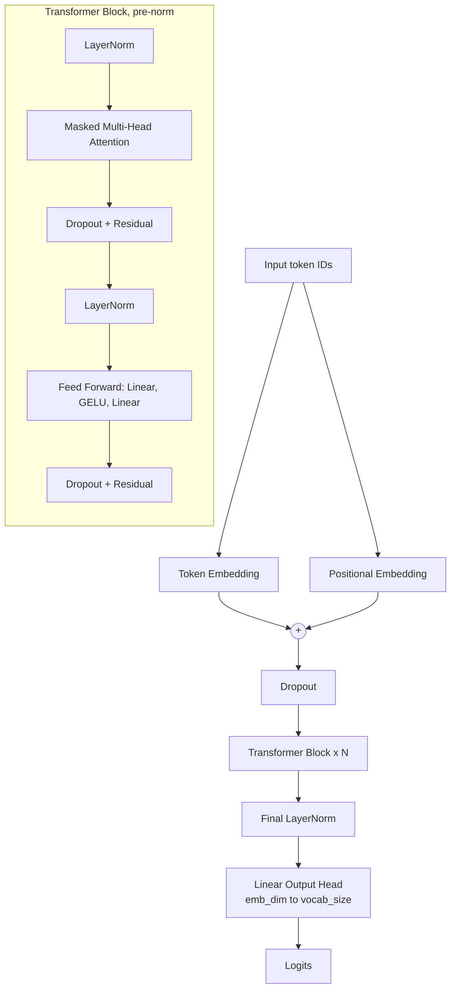

# 🧠 LLM from Scratch: Building a GPT-style Language Model with PyTorch

[](https://www.python.org/)
[](https://pytorch.org/)
[](https://jupyter.org/)
[](#-current-status-and-known-issues)
[](https://opensource.org/licenses/MIT)

A hands-on, educational implementation of a **decoder-only Large Language Model (GPT architecture)** written from scratch with **Python, PyTorch and the underlying math**. The notebook starts with the attention mechanism on a tiny hand-made tensor and builds up, step by step, to a full GPT model with a training loop, text generation, and loading of the official GPT-2 (124M) weights.

---

## 📑 Table of Contents

- [Project Overview](#-project-overview)
- [What Is Implemented](#-what-is-implemented)
- [Current Status and Known Issues](#-current-status-and-known-issues)
- [Repository Structure](#-repository-structure)
- [Notebook Walkthrough](#-notebook-walkthrough)
- [Architecture](#-architecture)
- [Dataset](#-dataset)
- [Training Setup](#-training-setup)
- [Text Generation](#-text-generation)
- [Installation](#-installation)
- [Usage](#-usage)
- [Roadmap](#-roadmap)
- [Acknowledgements](#-acknowledgements)
- [License](#-license)
- [Author](#-author)

---

## 📌 Project Overview

Modern LLMs such as GPT are stacks of **Transformer decoder blocks**. This project rebuilds every important piece by hand, instead of calling a ready-made library, to understand how they work:

1. **Multi-head causal self-attention**, first traced step by step on a toy tensor, then packaged as a class
2. **Positional information**: sinusoidal encoding and learned positional embeddings
3. **Layer normalization, GELU and feed-forward** sublayers with residual (shortcut) connections
4. **A full GPT model** (token embeddings, Transformer blocks, final norm, output head)
5. **Data pipeline**: GPT-2 BPE tokenization with a sliding-window dataset and DataLoader
6. **Training loop**: cross-entropy loss, AdamW, periodic train/validation evaluation
7. **Decoding strategies**: greedy decoding, temperature scaling and top-k sampling
8. **Loading pretrained GPT-2 (124M) weights** into the custom model

Everything lives in one notebook: `LLM from scratch.ipynb`.

---

## ✨ What Is Implemented

| Component | Where in the notebook | Notes |
|---|---|---|
| Q, K, V linear projections | Step-by-step demo + `MultiHeadAttention` | Shapes traced at every step |
| Splitting into heads | `view` + `transpose` | `(b, tokens, d_out)` to `(b, heads, tokens, head_dim)` |
| Scaled dot-product attention | `query @ key.T / sqrt(head_dim)` | Softmax over the last dimension |
| Causal mask | `torch.triu(..., diagonal=1)` + `masked_fill_(-inf)` | Prevents attending to future tokens |
| Attention dropout and output projection | `MultiHeadAttention` | Heads are concatenated and projected |
| Sinusoidal positional encoding | `Positional_Encoding()` | Sine on even dims, cosine on odd dims |
| Learned positional embeddings | `GPTModel.pos_emb` | `nn.Embedding(context_length, emb_dim)` |
| Layer normalization | `LayerNorm` | Learnable scale and shift, `eps=1e-5` |
| GELU activation | `GELU` | Tanh approximation |
| Pre-norm Transformer block | `TransformerBlock` | LayerNorm, attention, dropout, residual; LayerNorm, feed-forward, dropout, residual |
| GPT model | `GPTModel` | Token + position embeddings, N blocks, final norm, vocabulary head |
| Tokenization | `tiktoken` (`gpt2` encoding) | `text_to_tokens` and `tokens_to_text` helpers |
| Dataset and loader | `GPTDatasetV1`, `create_dataloader_v1` | Sliding window, targets shifted by one token |
| Loss | `calc_loss_batch`, `calc_loss_loader` | Cross-entropy over flattened logits |
| Training | `train_model`, `evaluate_model`, `generate_and_print_sample` | Prints a sample after each epoch |
| Decoding | `generate_text_simple`, `generate` | Greedy, temperature, top-k, optional EOS stop |
| Pretrained weights | `load_weights_into_gpt` | Maps GPT-2 tensors into the custom model |

---

## 🚧 Current Status and Known Issues

> **This is a learning notebook that is still a work in progress. It is not yet runnable from top to bottom.**

**What works (cells 1 to 21):** the attention walkthrough on a toy tensor has been executed and its outputs are saved in the notebook.

**What has not been executed yet:** everything from the `MultiHeadAttention` class onward (the Transformer block, GPT model, dataset, training, generation and weight loading) has no saved outputs. The first of those cells fails with `NameError: name 'nn' is not defined`.

| # | Issue | How to fix |
|---|---|---|
| 1 | `torch.nn` is never imported, but `nn.Module`, `nn.Linear` and so on are used | Add `import torch.nn as nn` to the first cell |
| 2 | `FeedForward` is used by `TransformerBlock` but never defined | Add a class: Linear(emb, 4x emb), GELU, Linear(4x emb, emb) |
| 3 | `Transformer` is called by the `LLM` class and in the demo cell but is not defined | Remove the early `LLM` experiment, or define the class |
| 4 | `GPTModel()` is called with no arguments, but its constructor requires a `cfg` dictionary | Define a config dict (see below) and pass it in |
| 5 | The GPT-2 section calls `GPTModel(d_in=..., no_of_transformer_blocks=...)`, which does not match the `cfg`-based constructor | Use `GPTModel(cfg)` with the 124M config |
| 6 | The weight loader uses `gpt.trf_blocks[b].mha`, but `TransformerBlock` names it `att` | Rename one of them so they match |
| 7 | `from gpt_weights import *` needs a `gpt_weights.py` file that is not in the repo (it must provide `download_and_load_gpt2`) | Add the helper file to the repo |
| 8 | `calc_loss_batch` is defined twice with different signatures | Keep only the `(input, target, model, device)` version |
| 9 | Cell 20 stores the result in a misspelled variable `contect_vec` and then prints the old `context_vec` | Fix the variable name |

**Config needed for the 124M GPT-2 model** (this is the standard GPT-2 small configuration):

```python
GPT_CONFIG_124M = {
    "vocab_size": 50257,
    "context_length": 1024,
    "emb_dim": 768,
    "n_heads": 12,
    "n_layers": 12,
    "drop_rate": 0.1,
    "qkv_bias": True,   # GPT-2 weights include Q/K/V biases
}
```

---

## 📂 Repository Structure

```
LLM-from-scratch/
│
├── LLM from scratch.ipynb   # Attention walkthrough, GPT model, training, generation, GPT-2 weight loading
├── the-verdict.txt          # Training text (a short story, ~20 KB)
└── README.md                # Project documentation
```

---

## 🗺 Notebook Walkthrough

### Part 1: Multi-head attention, step by step (cells 1 to 21, executed)

A toy input of shape `(2, 3, 4)` is used: batch of 2, 3 tokens, 4 features. Settings: `d_in = d_out = 4`, `context_length = 3`, `num_heads = 2`, so `head_dim = 2`.

| Step | Operation | Resulting shape |
|---|---|---|
| 1 | Input | `(2, 3, 4)` |
| 2 | Project to Q, K, V with `nn.Linear` | `(2, 3, 4)` each |
| 3 | Split into heads (`view`) | `(2, 3, 2, 2)` |
| 4 | Move the head dimension forward (`transpose`) | `(2, 2, 3, 2)` |
| 5 | Attention scores `Q @ K^T` | `(2, 2, 3, 3)` |
| 6 | Apply causal mask (`-inf` above the diagonal) | `(2, 2, 3, 3)` |
| 7 | Scale by `sqrt(head_dim)` and softmax | `(2, 2, 3, 3)` |
| 8 | Dropout, then `weights @ V` | `(2, 2, 3, 2)` |
| 9 | Merge the heads back | `(2, 3, 4)` |
| 10 | Output projection | `(2, 3, 4)` |

The masked softmax output confirms the causal behaviour. For each head, the first token attends only to itself (`[1.0, 0, 0]`), the second splits attention between tokens 1 and 2, and so on, with every row summing to 1.

### Part 2: Reusable modules (cells 22 to 35)

`MultiHeadAttention`, sinusoidal `Positional_Encoding`, `LayerNorm`, `GELU`, `TransformerBlock`, `GPTModel`, greedy `generate_text_simple`, and tokenizer helpers.

### Part 3: Data and loss (cells 36 to 51)

Tokenization with the GPT-2 BPE tokenizer, the sliding-window `GPTDatasetV1`, train/validation loaders, and the cross-entropy loss functions.

### Part 4: Training and generation (cells 52 to 57)

`train_model` with periodic evaluation, and an improved `generate` function with temperature and top-k sampling.

### Part 5: Pretrained GPT-2 weights (cells 58 to 65)

Downloads the 124M GPT-2 parameters and copies them, tensor by tensor, into the custom `GPTModel` using a shape-checked `assign` helper.

---

## 🏗 Architecture



**Attention formula used**

```
Attention(Q, K, V) = softmax( (Q K^T) / sqrt(head_dim) + causal_mask ) V
```

---

## 📚 Dataset

`the-verdict.txt` is a short story of about **20 KB (about 3,600 words)**, a small public-domain text commonly used for demonstrating LLM training. The notebook splits it **90% / 10%** into training and validation text, by character position.

Because the text is tiny, a model trained on it will mostly memorize it. It is meant to demonstrate the training loop, not to produce a useful language model.

---

## 🏋️ Training Setup

| Setting | Value |
|---|---|
| Tokenizer | GPT-2 BPE (`tiktoken`) |
| Context length (training) | 256 tokens |
| Window length / stride | 256 / 256 (no overlap) |
| Batch size | 2 |
| Optimizer | AdamW, `lr = 0.001`, `weight_decay = 0.1` |
| Epochs | 10 |
| Evaluation | Every 5 steps, using 5 batches |
| Sample prompt | `"Every effort moves you"` |
| Random seed | 123 |
| Device | CUDA if available, otherwise CPU |

---

## ✍️ Text Generation

Two decoding functions are included:

- **`generate_text_simple`**: always picks the most likely next token (greedy).
- **`generate`**: adds **top-k filtering**, **temperature scaling** and an optional **end-of-sequence stop**. With `temperature = 0` it falls back to greedy decoding.

```python
token_ids = generate(
    model=model,
    idx=text_to_tokens("Every effort moves you", tokenizer),
    max_new_tokens=50,
    context_size=256,
    top_k=25,
    temperature=0.7,
)
print(tokens_to_text(token_ids, tokenizer))
```

---

## 🚀 Installation

```bash
# 1. Clone the repository
git clone https://github.com/ajayn3300/LLM-from-scratch.git
cd LLM-from-scratch

# 2. (Recommended) create a virtual environment
python -m venv venv
source venv/bin/activate        # Windows: venv\Scripts\activate

# 3. Install dependencies
pip install torch tiktoken numpy jupyter
```

The GPT-2 weight download section additionally needs a `gpt_weights.py` helper (not yet in this repo), which typically depends on `tensorflow`, `tqdm` and `requests`.

---

## ▶️ Usage

```bash
jupyter notebook
```

Open **`LLM from scratch.ipynb`**.

- **Parts 1 and 2 (attention walkthrough)** can be explored right away after adding `import torch.nn as nn` to the first cell.
- **Parts 3 to 5 (training and GPT-2 weights)** need the fixes listed in [Current Status and Known Issues](#-current-status-and-known-issues).

---

## 🔮 Roadmap

- [ ] Fix the known issues so the notebook runs end to end
- [ ] Move the model code into a `model.py` module and the training code into `train.py`
- [ ] Save training and validation loss curves as plots
- [ ] Add a `requirements.txt`
- [ ] Add the `gpt_weights.py` helper and verify the loaded GPT-2 output against a reference
- [ ] Add model checkpoint saving and loading
- [ ] Train on a larger corpus
- [ ] Add learning-rate warmup and cosine decay, and gradient clipping
- [ ] Fine-tune the model for classification and instruction following

---

## 🙏 Acknowledgements

The structure and naming of this project (for example `GPTDatasetV1`, `create_dataloader_v1`, `generate_text_simple`, the `the-verdict.txt` sample and the GPT-2 weight-loading flow) follow the approach of *Build a Large Language Model (From Scratch)* by Sebastian Raschka. Please credit the book and its official repository if you reuse this work.

---

## 📄 License

This project is released under the **MIT License**. See the `LICENSE` file for details.

---

## 👤 Author

**Ajay**  
GitHub: [@ajayn3300](https://github.com/ajayn3300)

⭐ If you found this project useful, consider giving it a star!
